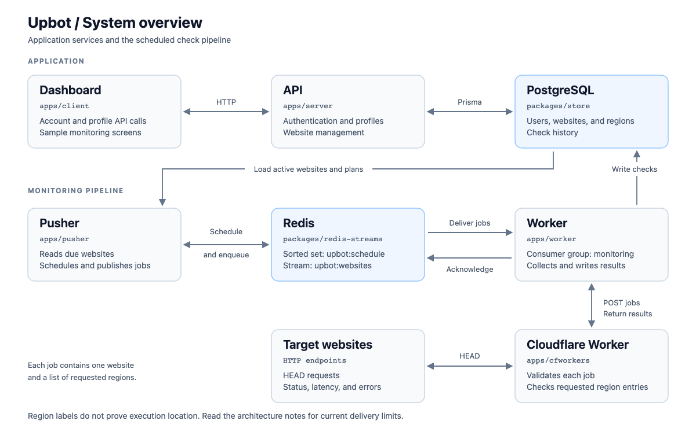
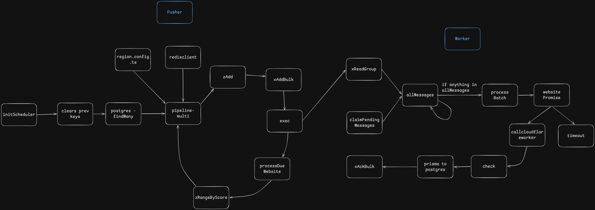

# Upbot

**Scheduled HTTP checks with Redis Streams and Cloudflare Workers.**

Upbot checks websites on a schedule and stores their status, response time, HTTP status code, and errors. The scheduler, queue consumer, HTTP checker, and API run as separate services. This keeps slow network requests out of the API and lets workers share the checking workload.

The project is a TypeScript monorepo built with Bun and Turborepo. It includes a Next.js dashboard and a separate landing page.

[Architecture](#architecture) · [Local setup](#local-setup) · [API](#api) · [Development status](#development-status)

## What is implemented

- Website management through an Express API, including check intervals and soft deletion.
- A Redis sorted set that tracks when each website is due for a check.
- Redis Streams with a shared consumer group, batch processing, and pending message recovery.
- A Cloudflare Worker that makes HTTP `HEAD` requests and returns check results.
- PostgreSQL storage for websites, regions, and check history through Prisma.
- Authentication code for email verification, password hashing, access tokens, and refresh tokens.

The monitoring backend is the main implementation. The dashboard has sample monitoring data, and some product features still need integration. See [development status](#development-status) for the current limits.

## Architecture



### How a check moves through the system

1. The API stores a website and its monitoring settings in PostgreSQL.
2. The pusher reads active websites and adds them to `upbot:schedule`. Each entry is scored by its next check time.
3. Every five seconds, the pusher reads due entries, selects region metadata from the user's plan, and writes one job per website to `upbot:websites`.
4. Workers read jobs through the `monitoring` consumer group. They also claim messages that have been pending for at least 30 seconds.
5. Each worker sends jobs to the Cloudflare Worker, which checks the target URL once for each requested region entry.
6. The worker collects the results, attempts a bulk insert into PostgreSQL, and acknowledges messages that returned checks.

The requested region codes are part of the current job format. They do not establish that checks ran from those locations. Database writes and queue acknowledgements also need stronger failure handling. Both are covered in the [architecture notes](docs/architecture/README.md#current-limits).

### Scheduler and worker detail



This original sketch follows the scheduler and worker functions. The [architecture notes](docs/architecture/README.md) explain the queue contract, timing, and design choices. The [editable Excalidraw board](docs/architecture/architecture.excalidraw) also includes earlier ideas and future designs.

## Repository layout

| Path                                                                                                           | Responsibility                                                                       |
| -------------------------------------------------------------------------------------------------------------- | ------------------------------------------------------------------------------------ |
| [`apps/pusher`](apps/pusher)                                                                                   | Loads websites, maintains the schedule, and publishes check jobs.                    |
| [`apps/worker`](apps/worker)                                                                                   | Consumes jobs, calls the HTTP checker, and stores results.                           |
| [`apps/cfworkers`](apps/cfworkers)                                                                             | Cloudflare Worker that validates jobs and checks target URLs.                        |
| [`apps/server`](apps/server)                                                                                   | Express API for authentication, profiles, websites, and alert channel configuration. |
| [`apps/client`](apps/client)                                                                                   | Next.js dashboard, account screens, and monitoring UI.                               |
| [`apps/web`](apps/web)                                                                                         | Landing page and waitlist, with its own Prisma schema.                               |
| [`apps/tests`](apps/tests)                                                                                     | Early API integration tests.                                                         |
| [`packages/redis-streams`](packages/redis-streams)                                                             | Shared stream publishing, consumption, acknowledgement, and recovery functions.      |
| [`packages/store`](packages/store)                                                                             | Monitoring database schema and shared Prisma client.                                 |
| [`packages/ui`](packages/ui)                                                                                   | Shared React components.                                                             |
| [`packages/eslint-config`](packages/eslint-config), [`packages/typescript-config`](packages/typescript-config) | Shared lint and TypeScript settings.                                                 |
| [`docs/architecture`](docs/architecture)                                                                       | Diagrams, editable sources, and architecture notes.                                  |

## Stack

| Area                  | Tools                                        |
| --------------------- | -------------------------------------------- |
| Runtime and language  | Bun, TypeScript                              |
| API                   | Express, Zod, JWT, bcrypt, Nodemailer        |
| Scheduling and queue  | Redis sorted sets, Redis Streams             |
| HTTP checks           | Cloudflare Workers, Wrangler                 |
| Database              | PostgreSQL, Prisma                           |
| Frontend              | Next.js 15, React 19, Tailwind CSS, Recharts |
| Workspace and tooling | Turborepo, Bun workspaces, ESLint, Prettier  |

## Local setup

You need Bun, Node.js for the Next.js apps, PostgreSQL, and Redis. A Cloudflare account is needed to deploy the HTTP checker. You can run it locally with Wrangler first.

Use a dedicated development database and Redis instance. The pusher rebuilds `upbot:schedule` when it starts.

### 1. Install dependencies

```bash
git clone https://github.com/shaurya35/upbot.git
cd upbot
bun install
```

### 2. Configure the services

```bash
cp packages/store/.env.example packages/store/.env
cp apps/pusher/.env.example apps/pusher/.env
cp apps/worker/.env.example apps/worker/.env
cp apps/server/.env.example apps/server/.env
```

Fill in the following values. Some example files contain only part of the configuration, so use this table as the reference.

| File                  | Variables                                                                                                                           |
| --------------------- | ----------------------------------------------------------------------------------------------------------------------------------- |
| `packages/store/.env` | `DATABASE_URL` for the monitoring database.                                                                                         |
| `apps/pusher/.env`    | `REDIS_URL`. The schedule key is currently fixed in code.                                                                           |
| `apps/worker/.env`    | `REDIS_URL`, `WORKER_URL`, and an optional `WORKER_ID` that is unique to each consumer.                                             |
| `apps/server/.env`    | `PORT=8080`, `JWT_SECRET`, `JWT_REFRESH_SECRET`, `EMAIL_USER`, and `EMAIL_PASS`. Email credentials are used for Gmail OTP delivery. |
| `apps/client/.env`    | `NEXT_PUBLIC_BACKEND_URL=http://localhost:8080`. Create this file manually.                                                         |

The service commands below also load `packages/store/.env`, so they share the monitoring database connection. If a service file also sets `DATABASE_URL`, keep it pointed at the same database. Pusher and worker must use the same Redis instance.

### 3. Prepare a new development database

The monitoring schema is in `packages/store/prisma/schema.prisma`. The landing page schema in `apps/web/prisma` is separate.

```bash
cd packages/store
bunx prisma generate
bunx prisma db push
cd ../..
```

These commands are for a new development database. For an existing database, review schema differences before applying changes.

The pusher uses fixed region IDs from `apps/pusher/region.config.ts`. Insert those same IDs into a new database so check results can reference them:

```bash
bun --env-file=packages/store/.env -e '
import { prisma } from "./packages/store/index.ts";
import { ALL_REGIONS } from "./apps/pusher/region.config.ts";

try {
  await prisma.region.createMany({
    data: ALL_REGIONS,
    skipDuplicates: true,
  });
} finally {
  await prisma.$disconnect();
}
'
```

The existing `seed.ts` uses different region codes, and `seed.sql` creates random IDs. Neither matches the pusher's fixed IDs. If you already have region rows, compare them with `region.config.ts` before running the pipeline.

### 4. Start the HTTP checker

Run this from the repository root in its own terminal:

```bash
bun run --cwd apps/cfworkers dev
```

Set `WORKER_URL` in `apps/worker/.env` to the local URL printed by Wrangler, usually `http://localhost:8787`.

To use a deployed checker instead:

```bash
bun run --cwd apps/cfworkers deploy
```

Set `WORKER_URL` to the deployed URL printed by Wrangler.

### 5. Start the API, scheduler, worker, and dashboard

Run each command from the repository root in a separate terminal:

```bash
# API
bun --env-file=packages/store/.env --env-file=apps/server/.env apps/server/index.ts

# Scheduler
bun --env-file=packages/store/.env --env-file=apps/pusher/.env apps/pusher/index.ts

# Queue consumer
bun --env-file=packages/store/.env --env-file=apps/worker/.env apps/worker/index.ts

# Dashboard
bun run --cwd apps/client dev --port 3000
```

Open the dashboard at `http://localhost:3000`. The API currently allows that browser origin through CORS.

The root `bun run dev` starts workspaces that define a `dev` script. The API, pusher, and worker currently have no such scripts, so start them explicitly as shown above.

### 6. Check the API

```bash
curl http://localhost:8080/health
```

Expected response:

```json
{ "message": "Health Check!" }
```

This confirms that the API is running. To verify the monitoring pipeline, create a website through the API and check for new `Check` rows in PostgreSQL. New websites are picked up by the scheduler's five-minute refresh, then run according to their interval.

## API

| Method                 | Route                     | Purpose                                            |
| ---------------------- | ------------------------- | -------------------------------------------------- |
| `GET`                  | `/health`                 | API health response.                               |
| `POST`                 | `/api/v1/auth/signup`     | Request an email verification code.                |
| `POST`                 | `/api/v1/auth/verify-otp` | Verify the code and create an account.             |
| `POST`                 | `/api/v1/auth/signin`     | Sign in and receive an access token.               |
| `POST`                 | `/api/v1/auth/refresh`    | Refresh the access token using the refresh cookie. |
| `POST`                 | `/api/v1/auth/signout`    | Clear the refresh cookie.                          |
| `POST`                 | `/api/v1/profile`         | Read the profile using the refresh cookie.         |
| `GET`, `POST`          | `/api/v1/website`         | List or create websites.                           |
| `GET`, `PUT`, `DELETE` | `/api/v1/website/:id`     | Read, update, or soft-delete a website.            |

Website routes require `Authorization: Bearer <access-token>`. For example:

```bash
curl -X POST http://localhost:8080/api/v1/website \
  -H 'Authorization: Bearer <access-token>' \
  -H 'Content-Type: application/json' \
  -d '{"name":"Example","url":"https://example.com"}'
```

Alert channel routes are mounted at `/api/v1/alert`, but their authentication middleware still needs to be connected. Check history routes exist in source but are not mounted by the server. Team routes are also disabled.

## Development status

The repository contains the monitoring pipeline and the product UI. It still needs work before a complete hosted monitoring service:

- **Dashboard:** website lists and charts use sample data. Live check history needs API integration.
- **Monitoring reliability:** database failures can still be followed by queue acknowledgements. Schedule refresh also needs to handle edits and deleted websites.
- **Regional checks:** region metadata is configured, but execution from each requested location needs a verified routing design.
- **Product features:** incident detection, alert delivery, public status pages, team access, and billing remain planned or partially scaffolded.
- **Tests:** the API tests reference an old `/api/v1/ping` route, and the Cloudflare tests still expect `Hello World!`. They need to be updated to cover the current behavior.

See the [architecture notes](docs/architecture/README.md) for the exact limits and the next engineering steps.

## Working on the project

```bash
bun run build        # Build workspaces that define a build script
bun run lint         # Lint workspaces that define a lint script
bun run check-types  # Run available workspace type checks
bun run format       # Format TypeScript, TSX, and Markdown files
```

These tasks cover the scripts defined by each workspace. They do not provide a complete backend test suite.

Keep changes focused on one service or behavior. Include the setup needed to reproduce the change and the checks you ran. If the job format, schema, or service flow changes, update the architecture notes and diagrams with it.
