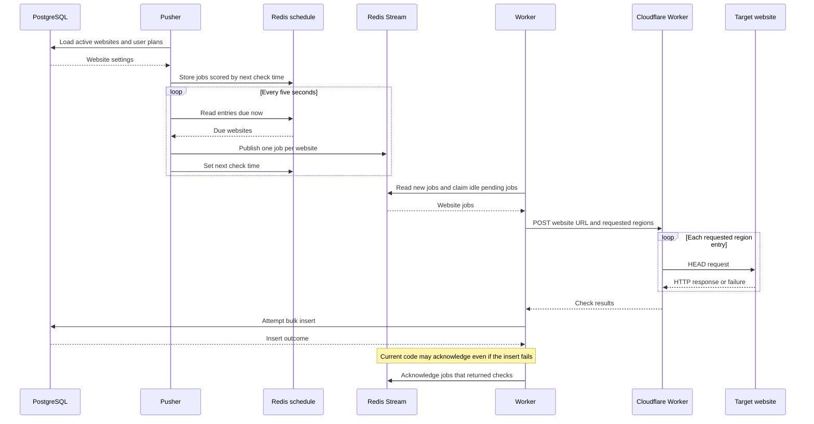

# Architecture

Upbot separates the request API from scheduled monitoring work. PostgreSQL stores the websites and check history. Redis holds the schedule and jobs. A queue consumer calls a Cloudflare Worker to perform HTTP checks.

## Diagrams

| File                                        | Purpose                                                                    |
| ------------------------------------------- | -------------------------------------------------------------------------- |
| [System overview](system-overview.png)      | Main services and data paths in the current implementation.                |
| [Overview source](system-overview.svg)      | Editable vector source for the overview image.                             |
| [Scheduler and worker](low-level.png)       | Original sketch of the scheduler and queue consumer functions.             |
| [Excalidraw board](architecture.excalidraw) | Original editable board, including early product ideas and future designs. |

The Excalidraw board includes Clerk, sharding, a time series database, and other design ideas. These are not all implemented. The overview and notes below describe the current code.

## Service boundaries

| Component         | Reads                                                         | Writes or returns                                            |
| ----------------- | ------------------------------------------------------------- | ------------------------------------------------------------ |
| API               | Users, websites, profiles, and alert channel records.         | Account and website records in PostgreSQL.                   |
| Pusher            | Active websites from PostgreSQL and due entries from Redis.   | Schedule entries and check jobs.                             |
| Redis Streams     | Jobs published by the pusher.                                 | Deliveries and pending message state for the consumer group. |
| Worker            | New jobs, pending jobs, and HTTP check results.               | Bulk check inserts and stream acknowledgements.              |
| Cloudflare Worker | A website URL, requested region metadata, and a timeout.      | Status, latency, HTTP status code, and error details.        |
| Dashboard         | Authentication and profile endpoints; sample monitoring data. | Local UI state for the monitoring screens.                   |

The landing page in `apps/web` is separate from the dashboard in `apps/client`. It uses its own waitlist database schema.

## Check lifecycle



## Scheduling

The pusher keeps the next check time in the Redis sorted set `upbot:schedule`. The score is a timestamp in milliseconds. The member is a JSON string containing the website settings and plan.

At startup, the pusher deletes the schedule key and rebuilds it from active websites. It spreads initial check times across each website's interval using a random delay.

Every five seconds, it reads members whose score is at or below the current time. It publishes their jobs, then writes their next check times. `monitorInterval` is stored in seconds and converted to milliseconds when computing the next run.

A separate five-minute refresh adds websites that are not already in the schedule. It currently does not update existing entries or remove deleted websites.

Code: [pusher](../../apps/pusher/index.ts), [plan and region configuration](../../apps/pusher/region.config.ts).

## Queue contract

All website jobs use one Redis Stream, `upbot:websites`. Workers share the `monitoring` consumer group. Each job contains a list of requested regions; the pusher does not publish a separate stream message for each region.

Example of a decoded job for a free-plan website:

```json
{
  "id": "website-id",
  "url": "https://example.com",
  "userId": "user-id",
  "regions": [
    {
      "regionId": "46dc26c3-2321-4244-9940-45c860d22676",
      "regionCode": "SFO"
    }
  ],
  "timeout": 10000,
  "monitorInterval": 60
}
```

In the stream, `regions` is stored as JSON text. Numeric values are stored as strings and parsed when a worker reads the message. The Redis message ID is separate from the website `id` and is used for acknowledgement.

The shared client reads up to ten new messages at a time and blocks for up to five seconds. It can also claim up to ten messages that have been idle for at least 30 seconds. `MAX_BATCH_SIZE` limits how many of the collected messages the worker processes; it does not change the stream read count.

Code: [Redis Streams client](../../packages/redis-streams/index.ts), [worker](../../apps/worker/index.ts).

## HTTP checks and storage

The Cloudflare Worker accepts `POST` requests. It validates the job shape and URL, requires at least one region entry, and runs the checks concurrently.

Each check uses `HEAD`, follows redirects, and aborts when its timeout expires. A successful HTTP response is recorded as `UP`. Other HTTP responses and request errors are recorded as `DOWN`. A target that rejects `HEAD` may therefore be marked down even if it serves `GET` requests successfully.

The worker combines the results and calls `prisma.check.createMany`. A check row references the website and region and records status, response time, status code, error, and creation time.

| Setting                         | Current value or default                                                    |
| ------------------------------- | --------------------------------------------------------------------------- |
| Scheduler polling               | 5 seconds.                                                                  |
| New website refresh             | 5 minutes.                                                                  |
| Default website interval        | 60 seconds, from the database schema.                                       |
| Timeout published by the pusher | 10 seconds.                                                                 |
| Cloudflare check timeout cap    | 30 seconds.                                                                 |
| Stream read size                | 10 messages.                                                                |
| Pending recovery                | Up to 10 messages idle for at least 30 seconds.                             |
| Worker `MAX_BATCH_SIZE`         | 50 jobs.                                                                    |
| Worker `WEBSITE_TIMEOUT`        | 3,600,000 ms; an outer processing deadline, separate from the HTTP timeout. |

Code: [Cloudflare Worker](../../apps/cfworkers/src/index.ts), [monitoring schema](../../packages/store/prisma/schema.prisma).

## Why these components are separate

- **Sorted set for scheduling:** next-run timestamps let the pusher select due websites without creating a timer for every site.
- **Stream for delivery:** the consumer group shares jobs across workers and tracks deliveries that have not been acknowledged.
- **Separate HTTP checker:** network requests run outside the API and can be changed independently of the queue consumer.
- **Bulk database writes:** the consumer combines check results into one insert operation for each batch.
- **Shared schema and queue package:** services use the same data model and job encoding.

The worker can have multiple consumers with distinct IDs. The pusher is currently designed as a single process. Adding more pushers would require coordination because each one deletes and rebuilds the same schedule key at startup.

## Current limits

### Database writes and acknowledgements

The worker collects acknowledgement IDs when a job returns checks. If the bulk insert fails, it logs the error and still acknowledges those IDs. An acknowledgement therefore does not prove that the results were saved.

The write and acknowledgement steps are not atomic. There is also no stable job-result key for deduplication: check IDs are generated by the database, so `skipDuplicates` does not prevent repeated results when a job is retried.

The next step is to acknowledge only after a successful write and define a unique result key before retry handling is treated as reliable. Stream retention and a limit on failed-job retries also need to be added.

### Schedule updates

The five-minute refresh only adds new websites. Changes to an existing website's interval, URL, or user plan are not copied into its schedule entry. Soft-deleted websites can remain scheduled until the pusher restarts.

Schedule members are full JSON strings. Changing that string creates a different sorted-set member, so updates need to remove the previous member or use stable website IDs with settings stored separately.

### Regional execution

The pusher chooses region metadata from the user's plan, and the Cloudflare code passes a `colo` field to `fetch`. This is not a verified mechanism for choosing where each request executes. Region labels in stored results should not be used as proof of geographic coverage.

Cloudflare documents `request.cf.colo` as information about the data center handling an incoming request. It is not listed as a supported outgoing `RequestInit.cf` placement option. See the [Cloudflare Request documentation](https://developers.cloudflare.com/workers/runtime-apis/request/).

The plan configuration also lists `TYO`, but `ALL_REGIONS` has no matching entry. Database region IDs must match the fixed IDs used by the pusher.

### Product integration and tests

The dashboard's website list and monitoring charts use sample data. Check routes are present but not mounted, and team routes are disabled. Alert channel handlers expect an authenticated user, but their router does not attach the authentication middleware.

Email OTP delivery exists. Incident detection and monitoring alert delivery are separate features that still need implementation. Public status pages and billing have database models but no complete service flow.

The OTP account creation code also assigns a boolean to `emailVerified`, while the Prisma schema defines it as `DateTime?`. That path needs to be aligned with the schema and tested.

The current test files do not validate this pipeline: API tests reference an old route and catch request failures, while Cloudflare tests still expect the starter `Hello World!` response. Useful coverage would verify job encoding, scheduler updates, failed-write recovery, retry deduplication, and the checker's request and response contract.
